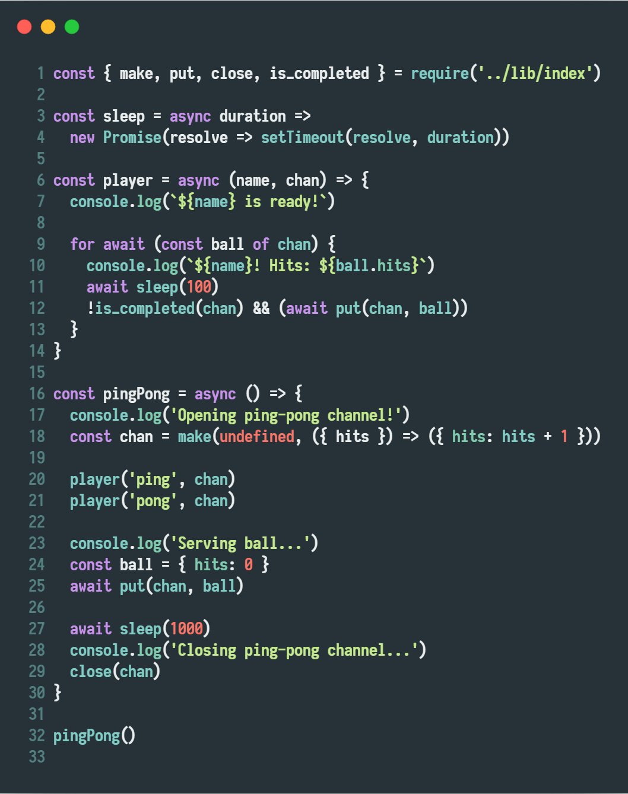

# Channel

Promise based channel implementation in BuckleScript/ReasonML/JavaScript. Most of the APIs have own corresponding form in Golang.

## API

### make

`val make : ?cap:int -> ?transformer:('a -> 'a) -> unit -> ('a, 'a) chan`
If `cap` is provided, then a buffered channel wil be created.

### cap

`val cap : 'a chan -> int option`

### close

`val close : 'a chan -> unit`

### is_completed

`val is_completed : 'a chan -> bool`

### deliver

`val deliver: 'a chan array -> 'a -> 'a Js.Promise.t`

deliver an item to any channel that is ready or will be the first to be ready

### put

`val put : 'a chan -> 'a -> 'a Js.Promise.t`

implemented using `deliver`

### take

`val take : 'a chan -> 'a Js.Promise.t`

taking an item from channel

### take_or

instead of waiting, yielding the specified val

### range

Receiving from a channel until it's closed is normally done using for range

identical to `for range` in Golang, implemented using iterator protocol

### oneof

`val oneof : 'a chan array -> 'a Js.Promise.t`

### oneof_or

`val oneof_or : 'a chan array -> 'a -> 'a Js.Promise.t`
instead of waiting, yielding the specified val
